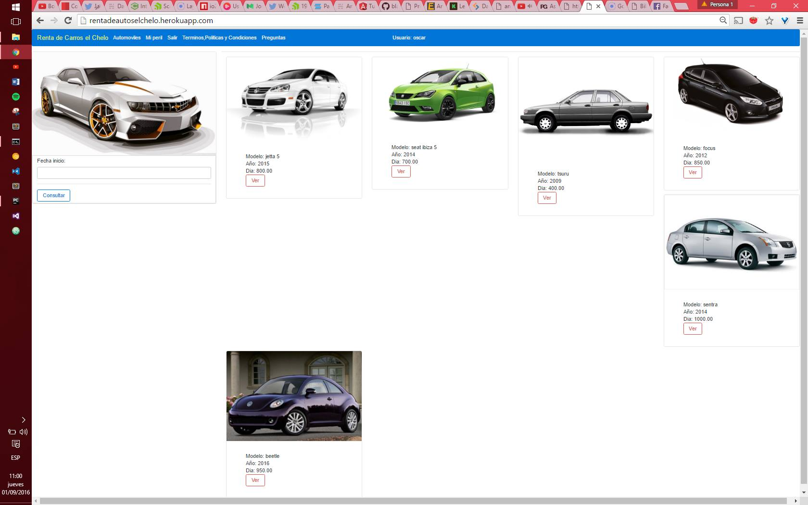
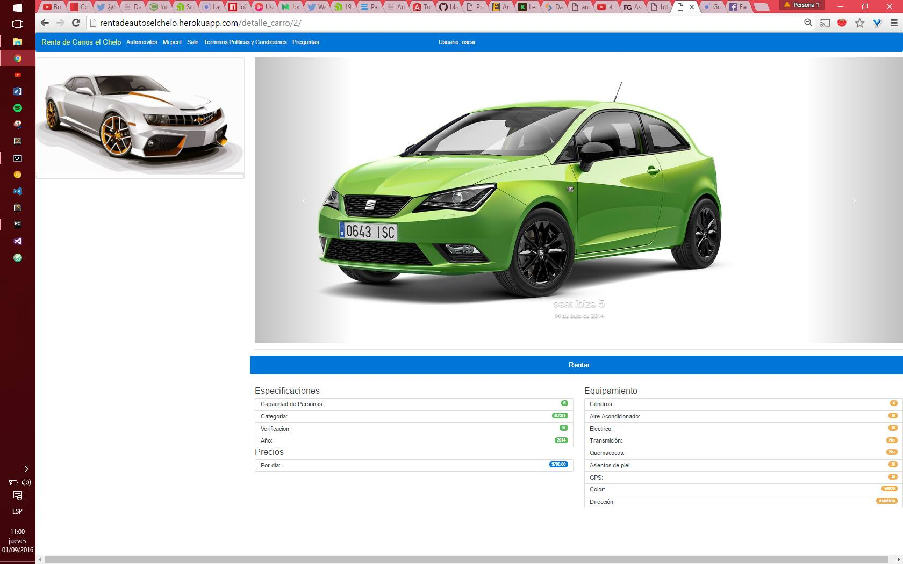

"# rentcarros" 

> sistema de rentas de autos.

Django==1.9.7

whitenoise==3.2
boto==2.39.0
pillow==3.1.1
django-jet == 0.1.4
django-storages == 1.4

---
> index

---
> detalle carro

> path chelo-heroku contiene la configuración necesaria para realizar deploy en heroku

[deploy](https://devcenter.heroku.com/articles/deploying-python)
